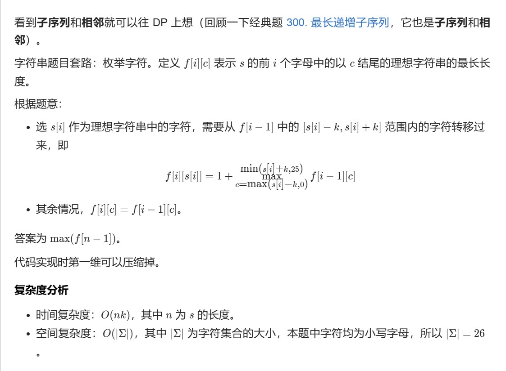

# 记忆化搜索

## 题号

62 63 64 120 931 **1335** **2435** **1043**

## 固定套路

- 以1335为例
```
func minDifficulty(jobDifficulty []int, d int) int {
	n := len(jobDifficulty)
	if n < d {
		return -1
	}
	memo := make([][]int, d)
	for i := range memo {
		memo[i] = make([]int, n)
		for j := range memo[i] {
			memo[i][j] = -1
		}
	}
	var dfs func(int, int) int
	dfs = func(i, j int) (res int) {
		p := &memo[i][j]
		if *p != -1 {
			return *p
		}

		defer func() { *p = res }()

		if i == 0 {
			for _, x := range jobDifficulty[:j+1] {
				res = max(res, x)
			}
			return
		}

		res = math.MaxInt
		mx := 0
		for k := j; k >= i; k-- {
			mx = max(mx, jobDifficulty[k])
			res = min(res, dfs(i-1, k-1)+mx)
		}
		return
	}
	return dfs(d-1, n-1)
}
func max(i, j int) int {
	if i > j {
		return i
	}
	return j
}

func min(i, j int) int {
	if i < j {
		return i
	}
	return j
}

```


# DP
## 子序列DP（划分型）

**子序列+相邻->DP**

子序列：枚举字符，而且常用f定义：f[i][j]表示*前i个*字符以j结尾的。。 或者是s[i]结尾的（最长子序列）

考虑选或者不选，就是比如选s[i]，**子问题**是从s前i个字母，f[n-1]是表示前n-1个字母

### 2370

