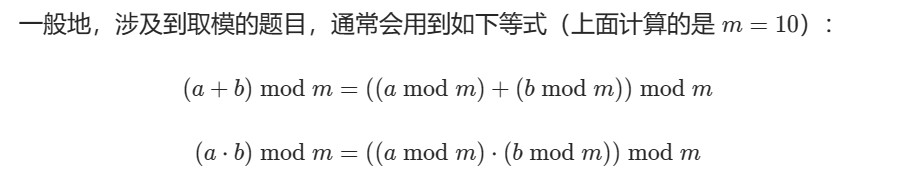

## 模运算

任何一个数mod k的结果应该是[0,k-1],最多有k个不同的余数，找k次即可


## 位运算

- 与1异或就是反转，与0异或就是本身

### 231

小技巧：`n & (n - 1)`将n的二进制表示的最低位的1移除，`n & (-n)`表示n的二进制最低位的1所对应的值

一个数与它的相反数与运算-1可以得到末尾0的个数 `n&(-n)-1`
反转字母的大小写：直接`^32`

 在C++中，可以使用位运算来找从低到高第一个为0的位置。具体来说，我们可以使用以下步骤：

将整数n和它减一之后的值n-1进行按位非操作，即~(n-1)。
结果中从低到高出现的第一个1的位置，就是n从低到高第一个0的位置。
这个方法的原理是：将n-1的补码取反，实际上是将n-1中最低位的0变成了1，并将该位下面的所有1都变成了0。对于n而言，如果最低位是0，则n-1中最低位的0就是n从低到高第一个0的位置；如果最低位是1，则n-1中最低位的0是n从低到高第二个0的位置。因此，查找n从低到高第一个0的位置，就转换成了查找n-1中最低位的0的位置。

下面是一个简单的实现：

int find_first_zero(int x) {
    return __builtin_ctz(~(x - 1));
}
这里同样使用了C++标准库中的__builtin_ctz函数，只是将其作用于~(x-1)而不是x^(x-1)。因为~(x-1)中最低位的1和其后面的0构成了一个连续的序列，所以调用__builtin_ctz即可找到最低位的1，这个位置就是n从低到高第一个0的位置。或者是 `n&(n-1)`
**负数的补码** ----> `1<<32+n`
### 762
`bits.OnesCount(uint(x))` 统计1的数量

```
func lowbit(x int) {
    return x & (-x)
}
```
- `num1 &= num1 - 1 // 最低的1变0` 2429
- `x|=x+1`是最低的0变1

- `i^1`是i+1或者i-1
- `0\1^1`正好相反

- **`python的map没有这个关键字会报错的`**


### 1178

`subset = (subset - 1) & mask`

**在subset减到 0 时，0 也是subset的子集，但是再 -1，会变成 -1，-1 二进制表示为 1111 1111，最高位1表示是负数，与mask做与运算，不相同位归零，重新变回mask，循环终止**

#### 枚举二进制子集
```
function get_subset(bitmask)
    subset = bitmask
    answer = [bitmask]
    while subset != 0
        subset = (subset - 1) & bitmask
        put subset into the answer list
    end while
    return answer
end function
```

## 同余定理

`(x-y) mod p = 0` 记作 `x=y(mod p)` 有相当于`(x mod p + p) mod p`

## 取模等式

`(a + b) mod m = ((a mod m)+ (b mod m)) mod m` 
`(ab) mod m = ((a mod m)(b mod m)) mod m`
**go的二分查找是sort.SearchInts**（大于等于）


## String

strings.Builder
sb.WriteByte(c)
WriteString